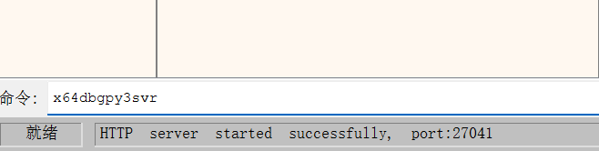
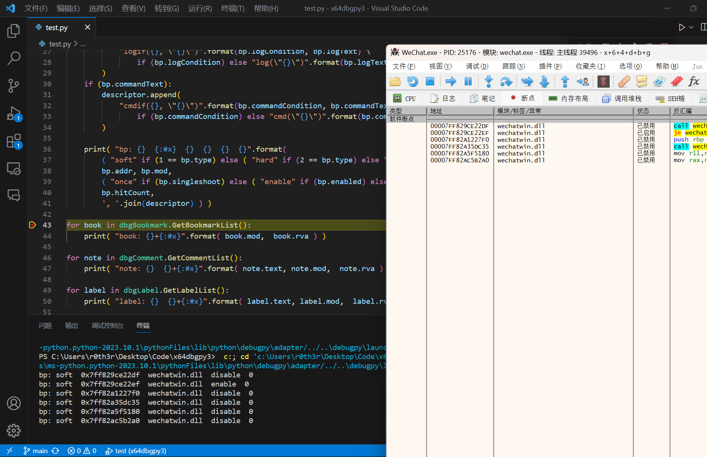

## x64dbgpy3 [中文说明](README-CN.md)

> [!WARNING]
> **This project is no longer actively maintained.**
> I have come to regard it as little more than a thin wrapper around the x64dbg SDK, one that no longer justifies active maintenance, and it was never designed with AI workflows in mind.
> Its successor offers first-class AI support: [x64dbgMCP](https://github.com/nblog/x64dbgMCP), a C++/CLI plugin that embeds an MCP server into x64dbg (a vibe coding project; keep the vibes immaculate).

**x64dbgpy3** is a plugin for [x64dbg](https://x64dbg.com/) that enables remote invocation via [HTTP-RPC](https://github.com/jsonrpcx/json-rpc-cxx) and the `x64dbgpy3svr` server. This allows for seamless integration with external tools and scripts, such as those written in Python.  
Contributions are welcome! Please see our [Pull Requests](https://github.com/nblog/x64dbgpy3/pulls) page.

---

### Getting Started

Start the server with the following command:

```sh
x64dbgpy3svr [port=27041],[host=localhost]
```

---

### Screenshots

  
*Running the x64dbgpy3 server*

  
*Testing with Python in VSCode*

---

### License

This project is licensed under the WTFPL License.  

---